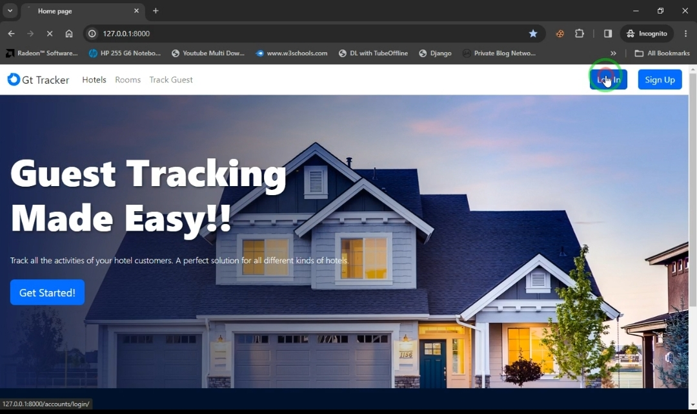
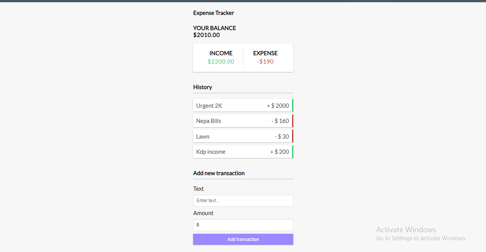

## Ohayo, Boss. Oreha Web Developer da 👋

## 🚀 About Me
Passionate Web developer who is interested in React, Django.
- 🔭 I’m currently working on personal projects.
- 📫 How to reach me: sikky606@gmail.com
- ⚡ Fun fact: One Punch Man is my favourite manga... Fubuki supremacy >>>

### My Projects
Mover: A freight broker webapp that connects customers with local drivers who have pickup trucks, minivans, and cargo vans, for moving large items.

Live Link: https://moverapp.onrender.com/
Repository: https://github.com/Co-Lab-You-Belong-in-Tech/mover
Tech Stack: Django, Bootstrap

GT Tracker

GT Tracker App is designed to streamline the management of guest check-ins and check-outs in a hotel or hospitality establishment

Live URL: Coming soon
Tech Stack: Django, Bootstrap
Repo: https://github.com/sparkle666/django-guest-app

A simple expenses tracker app to handle your little expenses.

Live URL: Coming soon
Tech Stack: ReactJs
Repo: https://github.com/sparkle666/exp-tracker

### Technical Articles
- 5 Entry Level React Native Bugs That Might Frustrate Your Life [With Solutions] [Read Here](https://dev.to/sparklesix/5-entry-level-react-native-bugs-that-might-frustrate-your-life-with-solutions-3abp)

- Step by Step Guide to using Reactstrap for building Web Apps With Sample Projects [Read Here](https://dev.to/sparklesix/step-by-step-guide-to-using-reactstrap-for-building-web-apps-with-sample-projects-455b)

- How to compress a large video without losing quality using FFmpeg with Termux [Read Here](https://dev.to/sparklesix/how-to-compress-a-large-video-without-losing-quality-using-ffmpeg-with-termux-1dhi)

- Solidity Tutorial: How to build and deploy a smart contract to send Ether from one account to another [Read Here...](https://dev.to/sparklesix/solidity-tutorial-how-to-build-and-deploy-a-smart-contract-to-send-ether-from-one-account-to-another-n54)
  
- Writing and Deploying A Solidity Smart Contract to Rinkeby Test Network [Read Here…](https://dev.to/sparklesix/writing-and-deploying-a-solidity-smart-contract-to-rinkeby-test-network-2d0k)
  
- Setting up and Deploying a solidity smart contract to Ropsten testnet with Alchemy and Hardhat [Read Here](https://sixtusanyanwu.hashnode.dev/setting-up-and-deploying-a-solidity-smart-contract-to-ropsten-testnet-with-alchemy-and-hardhat)

#### Open to new oppurtunities, arigato!
<!--
**sparkle666/sparkle666** is a ✨ _special_ ✨ repository because its `README.md` (this file) appears on your GitHub profile.

Here are some ideas to get you started:

- 🔭 I’m currently working on ...
- 🌱 I’m currently learning ...
- 👯 I’m looking to collaborate on ...
- 🤔 I’m looking for help with ...
- 💬 Ask me about ...
- 📫 How to reach me: ...
- 😄 Pronouns: ...
- ⚡ Fun fact: ...
-->
