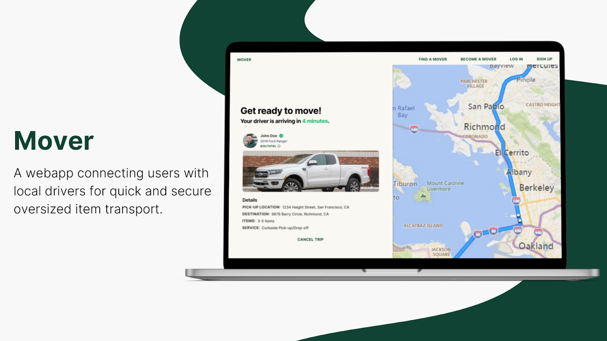

## Ohayo, Boss. Oreha Web Developer da 👋

## 🚀 About Me
Passionate Fullstack developer who is interested in ReactJs, AdonisJs, NextJs, Expo, React Native, FastApi, Django, AI, LLMs.
- 🔭 I’m currently working on personal projects.
- 📫 How to reach me: sikky606@gmail.com
- ⚡ Fun fact: One Punch Man is my favourite manga... Fubuki supremacy >>>

### My Projects

Declutta is a marketplace platform that connects people who want to declutter their homes with buyers looking for secondhand items. Users can list items for sale or giveaway, chat with potential buyers, manage wishlists, and complete secure transactions through Paystack integration.

I architected and built the complete backend infrastructure using AdonisJS and TypeScript, focusing on payment security, data integrity, and developer experience.

**Live API:** [Backend Repository](https://github.com/sparkle666/declutta-backend)

**Collinzo Cigars** — *collinzocigar.ng*  

**Live E-Commerce Store | Full-Stack (React.js + Firebase)**  

A premium online cigar lounge selling curated cigars, vapes, shisha, lighters & accessories. Features secure checkout, dynamic product catalog, user accounts, and real-time stock updates. Built for speed, SEO, and mobile-first shopping.  

**Key Features:**  
- Responsive product grid with Add-to-Cart  
- Secure Paystack payments (server-verified)  
- User auth (login/signup)  
- Location-based delivery (Benin City)  
- Newsletter signup & policy pages  

*Live at [collinzocigar.ng](https://collinzocigar.ng)*

#### Mover
A freight broker webapp that connects customers with local drivers who have pickup trucks, minivans, and cargo vans, for moving large items.

Live Link: https://moverapp.onrender.com/

Repository: https://github.com/Co-Lab-You-Belong-in-Tech/mover

Tech Stack: Django, Bootstrap

#### ProjectPro

ProjectPro is a Student Project Allocation and Management App for managing the allocation of project topics to students and assigning supervisors to them.

Live URL: https://projectpro-ohsu.onrender.com/

Tech Stack: Django, Bootstrap

Repo: https://github.com/sparkle666/student-project-management

#### GT Tracker

GT Tracker App is designed to streamline the management of guest check-ins and check-outs in a hotel or hospitality establishment

Live URL: Coming soon

Tech Stack: Django, Bootstrap

Repo: https://github.com/sparkle666/django-guest-app

#### Deliverooo Clone
A simple clone of deliveroo mobile app for food delivery.

Tech Stack: React Native.

Repo: https://github.com/sparkle666/deliveroo-clone

#### Expense Tracker

A simple expenses tracker app to handle your little expenses.

Live URL: Coming soon

Tech Stack: ReactJs

Repo: https://github.com/sparkle666/exp-tracker
#### Crypto News App

A web app for getting latest crypto newd and updates.

Tech Stack: ReactJs, Ant Design

Live Link: https://cryptopiaa.netlify.app/news

Repo: https://cryptopiaa.netlify.app/news

#### Breast Cancer Detection
A simple breast cancer detection model with Logistic Regression model.

Repo: https://github.com/sparkle666/breast-cancer-detection

### Open source contribution

#### Google Developer Group Aba
Designed the base Backend and built extensible APIs for the Developer group Backend.

Repo: https://github.com/sparkle666/gdg-aba-website-backend

### Technical Articles
- 5 Entry Level React Native Bugs That Might Frustrate Your Life [With Solutions] [Read Here](https://dev.to/sparklesix/5-entry-level-react-native-bugs-that-might-frustrate-your-life-with-solutions-3abp)

- Step by Step Guide to using Reactstrap for building Web Apps With Sample Projects [Read Here](https://dev.to/sparklesix/step-by-step-guide-to-using-reactstrap-for-building-web-apps-with-sample-projects-455b)

- How to compress a large video without losing quality using FFmpeg with Termux [Read Here](https://dev.to/sparklesix/how-to-compress-a-large-video-without-losing-quality-using-ffmpeg-with-termux-1dhi)

- Solidity Tutorial: How to build and deploy a smart contract to send Ether from one account to another [Read Here...](https://dev.to/sparklesix/solidity-tutorial-how-to-build-and-deploy-a-smart-contract-to-send-ether-from-one-account-to-another-n54)
  
- Writing and Deploying A Solidity Smart Contract to Rinkeby Test Network [Read Here…](https://dev.to/sparklesix/writing-and-deploying-a-solidity-smart-contract-to-rinkeby-test-network-2d0k)
  
- Setting up and Deploying a solidity smart contract to Ropsten testnet with Alchemy and Hardhat [Read Here](https://sixtusanyanwu.hashnode.dev/setting-up-and-deploying-a-solidity-smart-contract-to-ropsten-testnet-with-alchemy-and-hardhat)

#### Open to new oppurtunities, arigato!
<!--
**sparkle666/sparkle666** is a ✨ _special_ ✨ repository because its `README.md` (this file) appears on your GitHub profile.

Here are some ideas to get you started:

- 🔭 I’m currently working on ...
- 🌱 I’m currently learning ...
- 👯 I’m looking to collaborate on ...
- 🤔 I’m looking for help with ...
- 💬 Ask me about ...
- 📫 How to reach me: ...
- 😄 Pronouns: ...
- ⚡ Fun fact: ...
-->
